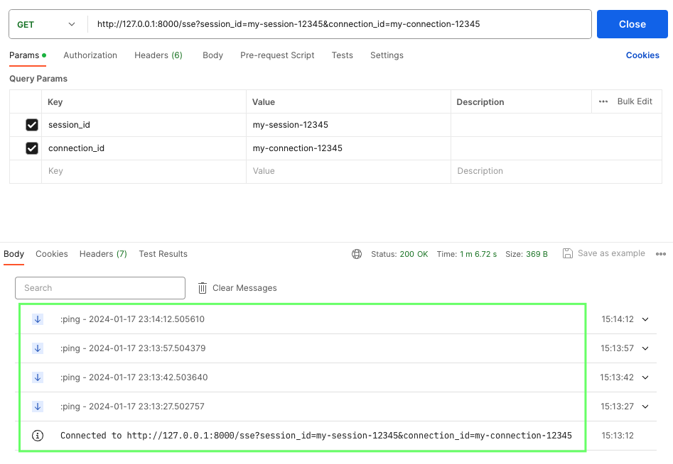

# Node Engine

[Node Engine](./node_engine/service.py) is a Python-based service that executes a computational flow. It is designed for rapid prototyping of services and applications, e.g. used as a chatbot service in a larger system. Each call to the service can provide a **flow definition**, dynamically adapting the service to the needs of the caller to facilitate experimentation and multiple simultaneous scenarios with different definitions. Each flow definition provides context and a list of components to execute. Components are configured via a registry visible to the service.

## Examples

If you are looking to just try something out, you can jump to the [Quickstart](#quickstart) guide below, for installation and running the service and examples.

The repository contains some [examples of components](examples/components), a corresponding [registry](examples/registry.json) you can test, copy, customize, etc., and a [chat app with UI](examples/apps/simple-chat-client/README.md) to chat with OpenAI LLMs.

A [client library](./node_engine/client.py) is included to simplify calling the service from other Python code.

There is also a [notebooks](./examples/notebooks/) directory with examples of how to develop new components and test them in the Node Engine, with an easy migration path to local components and then eventually to the Node Engine service, without any further code changes needed.

## Repository Guidance

This repository presents practices and architecture for rapid prototyping related to specific programming scenarios. Please note that the provided code serves as a demonstration and is not an officially supported Microsoft offering.

## Creating apps with Node Engine

Node Engine is designed for rapid experimentation and development of new components and flows. The core engine, components, and libs should remain minimal. See the [Development](./docs/DEVELOPMENT.md) guide for more info.

Why not [Semantic Kernel | Promptflow | Autogen | LangChain | etc.]? This framework has been built from the ground up specifically for the experimentation use-case for our team and next areas of investment. Each of those frameworks have their own idiosyncrasies that work well for their use-cases, but don't allow us to run as fast as we can with this approach and the ability for us to quickly extend it to meet our not-yet-discovered needs. Learnings from this framework will be used to inform future work in Semantic Kernel and other areas.

# Concepts

Detailed [documentation](./docs/node_engine/README.md) of Node Engine and how it works is provided.

### Flow

A flow is a sequence of components that are executed, starting with a trigger component that has the key value "start". A context object is passed to each component, which is intended for passing state and may be read from or updated by each component before being passed to the next component in the flow. The final context is returned to the caller when the flow completes.

### Component

A component is a Python class that implements an `execute` method that accepts a `FlowDefinition` and `FlowComponent` object. The `FlowDefinition` object contains the config and current context for the _flow_, which is passed to each component in the flow. The `FlowComponent` object contains the _current component_ metadata, including the component type, name, and config. The `execute` method returns an updated `FlowComponent` object, which is passed to the next component in the flow. It also returns a "next" value, which is the key of the next component in the flow. If the "next" value is "exit", the flow is complete and the final context is returned to the caller. A component can update the context, config, and next values as needed, allowing for dynamic flow control from both within the component and from the caller.

### Design

The design of the Node Engine is to be as simple as can be while still providing a high level of flexibility and extensibility. Where possible, new features should be implemented as components, keeping the core engine as simple as possible. Each component should be a black box. Components should be designed to be as stateless as possible, with any state needed to be stored in the context and/or separate persistent storage. Components can be as simple as a few lines of code or could be full blown services under the hood or hosted elsewhere. Since components can be called remotely, they can also be written in any language.

While most flows will await completion of each component, there is a [`BackgroundProcess`](./node_engine/components/background_process.py) component that can be used to run a component in the background and continue to the next component in the flow. This can be used to run long-running processes or processes that are not immediately needed, such as a memory extraction/processing component, while the flow continues to execute. The background process can emit events via SSE to notify the caller of progress and/or completion.

### Events

Components can emit events to connected clients via SSE. The SSE channel is managed by the main service, so callers can exist on any server or client via the `emit_sse_message` endpoint. The main service will emit events to all connected clients, so the caller can choose to filter events as needed.

### State

When state must be provided to a component, there are a few recommended approaches:

- If the state is only needed for the duration of the flow, store it in the context.
- If the state is needed for the duration of the session, store it in a persistent store and retrieve it at the start of the flow.

It is recommended to avoid storing flow-level state in the component config, as it is designed to be used for configuration and not state. Instead, update the context with the state and it will be passed to the remaining components in the flow.

# Quickstart

## Prerequisites

The steps below assume your dev environment has Python 3.10.11+ or 3.11+ installed and available in the console. You can execute this command to check your version: `python3 --version`.

It's highly recommended to develop with Node Engine using python virtual environments, with all the benefits that come. See https://docs.python.org/3/library/venv.html for details.

## Install Node Engine dependencies

These steps will set up all of the prerequisites for running the Node Engine
service locally, along with anything needed for the example scripts and notebooks.

You need to run these steps only once. If you already installed the dependencies
you can skip to the next section and start Node Engine service.

- Install python 3.11
- Create Python virtual environment:

      python3 -m venv .venv

- Activate the virtual environment:

      # On Windows:
      .venv\Scripts\activate

      # On macOS/Linux:
      source .venv/bin/activate

- Upgrade pip and install the nodeengine package (as editable):

      pip install --upgrade pip

      pip install -e .

- Create `.env` configuration file:

      cp .env.example .env

- Edit `.env` as needed, adding your credentials.

## Start Node Engine service

Unless Node Engine service is already running, open a terminal console and run
the following commands from the root of the project:

- Activate the virtual environment:

      # On Windows:
      .venv\Scripts\activate

      # On macOS/Linux:
      source .venv/bin/activate

- Start local Node Engine service. The service defaults to port 8000.

      # alternative with VS Code debugger:
      #    Shift+Ctrl+D and choose 'Node Engine Service'
      node_engine_service --registry_root examples

# Quick Tests

## #1 Run sample flow from command line

- After starting the service, open a new console.
- Activate the virtual environment:

      # On Windows:
      .venv\Scripts\activate

      # On macOS/Linux:
      source .venv/bin/activate

- Call the Node Engine service with a sample flow definition:

      python3 examples/scripts/invoke-flow.py examples/definitions/simple-continuation-chat.json --session_id sid123 --log_level debug --stream_log

- You should see a sample JSON output on screen, without errors, and a context containing "Hello World".

## #2 Test SSE (server side events) via Postman

- Launch Postman and create a new GET request with the following url:
  - `http://127.0.0.1:8000/sse?session_id=my-session-12345&connection_id=my-connection-12345`
- Click 'Send' to start the connection.
- Connection will remain open until you click 'Close' or the service stops or is
  restarted
- Events will be sent to the connection as they are emitted by the service and
  streamed as output in Postman. You should see some Ping events coming through:

  

# Next steps

Once the service is running, you can run the example [scripts](../examples/scripts/)
and [notebooks](../examples/notebooks/).

## Invoke a flow from command line

This [invoke-flow.py](examples/scripts/invoke-flow.py) script loads a flow definition and send it to the service to be executed. The examples/definitions folder contains some examples.

Example:

- Open a new console, activate the python virtual environment
- Run this command passing a session ID of your choice:

      python3 examples/scripts/invoke-flow.py examples/definitions/simple-cognition.json --session_id sid123 --log_level debug --stream_log

## Simple Chat client

The examples folder contain a sample chat app with a custom UI to chat with OpenAI models, see the [documentation here](examples/apps/simple-chat-client/README.md) to test it. In this case you won't need to start the service because the app starts the service automatically.

## Watch service logs

This [debug-service.py](examples/scripts/debug-service.py) script attaches to the service and emits log events for a specific session.

Example:

- Start the chat client in the examples folder, and copy the Session ID from the browser URL
- Open a new console, activate the python virtual environment
- Run this command passing the correct session ID:

      python3 examples/scripts/debug-service.py --log_level debug sid123

- Interact with the chat app and observe logs coming through in the console.

## Develop your apps

To experiment with developing new apps, scripts, flows and components, see the
[Development guide](docs/DEVELOPMENT.md) for more details.
